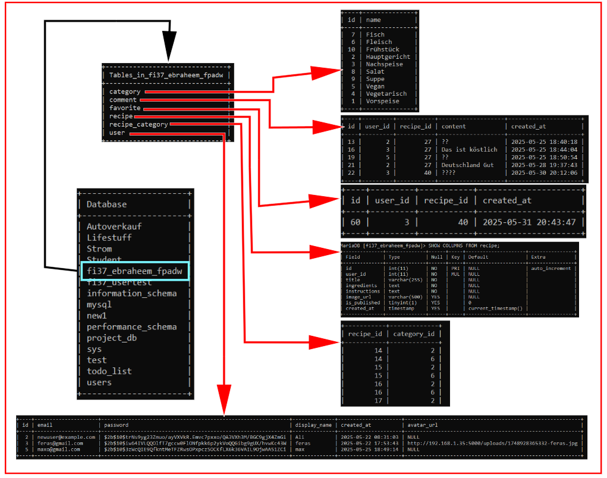
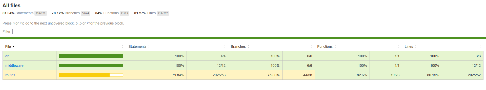
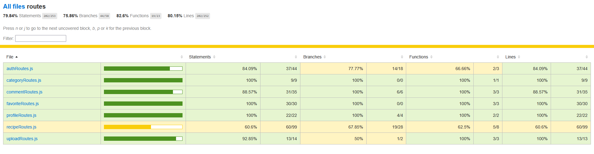
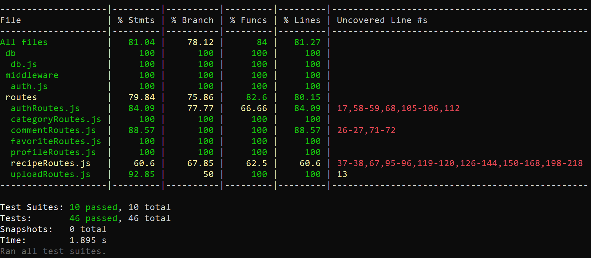

# Intranet Kochbuch Backend

A secure and feature-rich **RESTful API** backend for the internal Intranet Kochbuch (cookbook) application.
Built with **Node.js**, **Express**, and **MySQL**, this backend allows users to manage and share recipes,
mark favorites, add comments, and organize recipes using categories.

---

## 🔧 Features

- Registration and login with JWT authentication
- Password hashing using bcrypt
- CRUD operations for recipes
- Recipe categorization & publication
- User-specific favorites system
- Commenting system for recipes
- Image uploads via multer
- Middleware for authentication
- Structured project organization
- Static serving of uploaded images

---

## 📂 intranet-kochbuch-backend (Folder Structure)

```bash
📦 intranet-kochbuch-backend/
├──📁 coverage/                  # Jest coverage report (ignored in Git)
├──📁 node_modules/              # (ignored in Git)
├──📁docs/                       # (ERD, diagrams, etc.)
├──📁 sql/
│   └──📄 user_recipe.sql        # SQL schema or seed data
├──📁 src/
│   ├──📁 __tests__/           # All test suites
│   │   ├──📄 app.test.js
│   │   ├──📄 auth.test.js
│   │   ├──📄 authRoutes.test.js
│   │   ├──📄 categoryRoutes.test.js
│   │   ├──📄 commentRoutes.test.js
│   │   ├──📄 favoriteRoutes.test.js
│   │   ├──📄 init.test.js
│   │   ├──📄 profileRoutes.test.js
│   │   ├──📄 recipeRoutes.test.js
│   │   └──📄 uploadRoutes.test.js
│   ├──📁 db/
│   │   ├──📄 db.js              # DB connection handler
│   │   └──📄 init.js            # Tables initialization logic
│   ├──📁 middleware/
│   │   └──📄 auth.js            # JWT auth middleware
│   └──📁 routes/                # API route modules
│       ├──📄 authRoutes.js
│       ├──📄 categoryRoutes.js
│       ├──📄 commentRoutes.js
│       ├──📄 favoriteRoutes.js
│       ├──📄 profileRoutes.js
│       ├──📄 recipeRoutes.js
│       └──📄 uploadRoutes.js
├──📁 uploads/                   # Uploaded recipe images
├──📄 app.js                     # Initializes Express app & loads routes
├──📄 server.js                  # Entry point to run the server
├──📄 .env                       # Environment config (not committed)
├──📄 example.env                # Template for .env setup
├──📄 jest.config.js             # Jest configuration
├──📄 package-lock.json
├──📄 package.json               # NPM scripts & dependencies
├──📄 .gitignore                 # Ignored files and folders
└──📄 README.md                  # This file
```

---

## 🛠️ Installation & Setup (No Docker)

### ✅ Prerequisites
- Node.js **v22.14.0** (latest LTS recommended)
- MySQL server running locally or remotely

### 📦 Install Dependencies
```bash
npm install
```

### ⚙️ Configure Environment
1. Copy the example file:
   ```bash
   cp example.env .env
   ```
2. Edit `.env` with your database and secret config:

| Variable     | Description                                  |
|--------------|----------------------------------------------|
| `PORT`       | Port on which the server runs (e.g. 5000)    |
| `DB_HOST`    | MySQL host (e.g. `localhost`)                |
| `DB_USER`    | MySQL username                               |
| `DB_PASS`    | MySQL password                               |
| `DB_NAME`    | MySQL database name                          |
| `JWT_SECRET` | Secret key to sign and verify JWT tokens     |

### 🧱 Initialize the Database
Create your database manually (if not already):
```sql
CREATE DATABASE your_db_name CHARACTER SET utf8mb4 COLLATE utf8mb4_unicode_ci;
```
The tables will be auto-created at server start via `init.js`.

### 🚀 Run the Server
- Development mode (with file watching):
```bash
npm run dev
```
- Production mode:
```bash
npm start
```

The API will run at: `http://localhost:5000`

---
## 🗃️ Entity Relationship Diagram (ERD)


---
## 📸 Screenshots Diagram



---

## 📑 Data Model Overview

### Table: `user`

| Column       | Type         | Description                   |
|--------------|--------------|-------------------------------|
| id           | INT          | Primary key                   |
| email        | VARCHAR(255) | Unique                        |
| password     | VARCHAR(255) | Hashed with bcrypt            |
| display_name | VARCHAR(100) | Display name                  |
| avatar_url   | VARCHAR(500) | Optional                      |
| created_at   | TIMESTAMP    | Default: current timestamp    |

### Table: `recipe`

| Column       | Type         | Description                   |
|--------------|--------------|-------------------------------|
| id           | INT          | Primary key                   |
| user_id      | INT          | Foreign key to user(id)       |
| title        | VARCHAR(255) | Recipe title                  |
| ingredients  | TEXT         | Recipe ingredients            |
| instructions | TEXT         | Step-by-step instructions     |
| image_url    | VARCHAR(500) | Image path (optional)         |
| is_published | BOOLEAN      | Published status              |
| created_at   | TIMESTAMP    | Timestamp of creation         |

### Other Tables

- `category(id, name)`
- `recipe_category(recipe_id, category_id)`
- `comment(id, recipe_id, user_id, content, created_at)`
- `favorite(user_id, recipe_id)`

---

## 📡 API Endpoints Overview

### Authentication

- `POST /api/register` – Register
- `POST /api/login` – Login

### User Profile

- `GET /api/profile` – Get profile *(JWT required)*
- `PUT /api/profile` – Update profile *(JWT required)*

### Recipes

- `POST /api/recipes` – Create recipe *(JWT required)*
- `GET /api/recipes` – Get user's recipes *(JWT required)*
- `PUT /api/recipes/:id` – Update recipe *(JWT required)*
- `DELETE /api/recipes/:id` – Delete recipe *(JWT required)*
- `PUT /api/recipes/:id/publish` – Publish recipe *(JWT required)*
- `PUT /api/recipes/:id/unpublish` – Unpublish recipe *(JWT required)*

### Public Recipes

- `GET /api/public-recipes` – List published recipes
- `GET /api/public-recipes/:id` – Get single recipe

### Comments

- `POST /api/comments/:recipeId` – Add comment *(JWT required)*
- `GET /api/comments/:recipeId` – Get comments
- `DELETE /api/comments/:commentId` – Delete comment *(JWT required)*

### Favorites

- `POST /api/favorites/:recipeId` – Add to favorites *(JWT required)*
- `GET /api/favorites` – Get favorites *(JWT required)*
- `DELETE /api/favorites/:recipeId` – Remove favorite *(JWT required)*

### Categories

- `GET /api/categories` – Get all categories

### File Upload

- `POST /api/upload-image` – Upload image *(multipart/form-data)*

---
## ❗ Error Handling

```json
{
  "error": "Error message"
}
```

| Status Code | Meaning                        |
|-------------|--------------------------------|
| 400         | Missing fields / invalid input |
| 401         | Unauthorized                   |
| 403         | Access denied                  |
| 404         | Not found                      |
| 500         | Internal server error          |

---
## 🧠 Developer Notes

- Node.js version: `v22.14.0`
- Database: **local**
- `uploads/` folder must be writable
- `init.js` automatically creates required tables
- Uploaded images served at: `http://localhost:5000/uploads/<filename>`
- Timestamps are in UTC

---

### 📤 Upload Image
```http
POST /api/upload-image
Content-Type: multipart/form-data
Form field: image
```
Response:
```json
{ "imageUrl": "http://192.168.1.35:5000/uploads/filename.png" }
```

More endpoints available in route files under `src/routes/`.

---

## 📸 Screenshots
Add screenshots of your API responses or Postman examples here. For example:

- `GET /api/public-recipes` result in browser
- Response after uploading a recipe image
- Example of login + token output

<!-- Example placeholder -->


---


# 🧪 API Backend Tests – Intranet-Kochbuch

This project includes comprehensive unit and integration tests for the backend API of the Intranet-Kochbuch system. All routes and core logic have been thoroughly tested.

---

## 📁 Test Structure

All test files are located in:  
`src/__tests__/`

Each file targets a specific route or functionality.

---

## ✅ Tested Routes

### 🔐 Authentication (src/routes/authRoutes.js)
- `POST /register` – Registers a new user, checks for duplicate emails
- `POST /login` – Authenticates user
- `GET /protected` – Protected route using JWT middleware

### 🍽️ Recipes (src/routes/recipeRoutes.js)
- `GET /public-recipes` – Fetches all public recipes
- `GET /recipes` – Fetches user's private recipes
- `POST /recipes` – Creates a new recipe
- `PUT /recipes/:id` – Updates an existing recipe
- `DELETE /recipes/:id` – Deletes a recipe

### 💬 Comments (src/routes/commentRoutes.js)
- `POST /comments/:recipeId` – Adds a comment to a recipe
- `GET /comments/:recipeId` – Retrieves comments for a recipe
- `DELETE /comments/:commentId` – Deletes a user’s comment

### ⭐ Favorites (src/routes/favoriteRoutes.js)
- `POST /favorites/:recipeId` – Adds a recipe to favorites
- `GET /favorites` – Retrieves all favorite recipes
- `DELETE /favorites/:recipeId` – Removes a recipe from favorites

### 📂 Categories (src/routes/categoryRoutes.js)
- `GET /categories` – Retrieves all available categories

### 👤 Profile (src/routes/profileRoutes.js)
- `GET /profile` – Retrieves user profile
- `PUT /profile` – Updates user profile

### 🖼️ Uploads (src/routes/uploadRoutes.js)
- `POST /upload-image` – Uploads a single image and returns its URL

### 🔧 App Initialization (app.js)
- Verifies that `initDatabase()` is called
- `GET /` – Base health check route
- Verifies route availability for `/api/public-recipes` and `/api/categories`

---

## 🧪 What Was Tested

| Aspect              | Description                                 |
|---------------------|---------------------------------------------|
| Validation          | Empty fields, required fields               |
| Success cases       | Correct responses and data creation         |
| Error handling      | Graceful fallback for DB or logic failures  |
| Authentication      | JWT token verification for protected routes |
| Integration         | Middleware, routing, DB interaction mocks   |
| File upload         | Proper handling of image upload requests    |

---

## 🛠️ Tools & Frameworks

- **Jest** – Unit testing framework
- **Supertest** – HTTP assertions for Express routes
- **@jest/globals** – ESM-compatible mocking
- **Node.js (ESM)** – Modern JavaScript modules

---

## ▶️ Running the Tests

```bash
npm test
```
---

## 📊 Test Coverage Report

The project uses Jest with built-in code coverage tracking (`--coverage`). This helps visualize which parts of the backend codebase are fully tested and where improvements are needed.

### 🔎 Key Coverage Stats

| Metric       | Value     |
|--------------|-----------|
| Statements   | **81.04%** |
| Branches     | **78.12%** |
| Functions    | **84%**    |
| Lines        | **81.27%** |

You can view the live report by running:

```bash
npm test
```
---
Then open this file in your browser:

```bash
/coverage/lcov-report/index.html
```
Or, with the server running at http://localhost:5000:

```bash
http://localhost:5000/coverage/
```

## 🖼️ Screenshots

🔹 Overall Coverage Summary

🔹 Routes Breakdown

🔹 CLI Report Snapshot


✅ Most routes reach 100% coverage.

📉 Some uncovered branches still exist in complex routes like recipeRoutes.js — these are marked for future enhancement.
---

## 📄 License

This project is licensed under the **MIT License**. Feel free to use, modify, and distribute with proper attribution.

---

## 🤝 Contributing

1. Fork the repository
2. Create your branch (`git checkout -b feature/xyz`)
3. Commit your changes (`git commit -am 'Add xyz'`)
4. Push to the branch (`git push origin feature/xyz`)
5. Open a Pull Request

Issues and suggestions are welcome via GitHub.

---

© 2025 Feras Ebraheem — All rights reserved.
